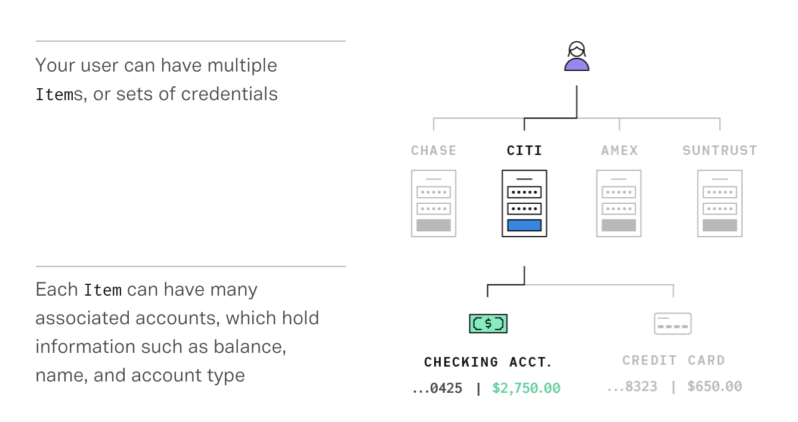
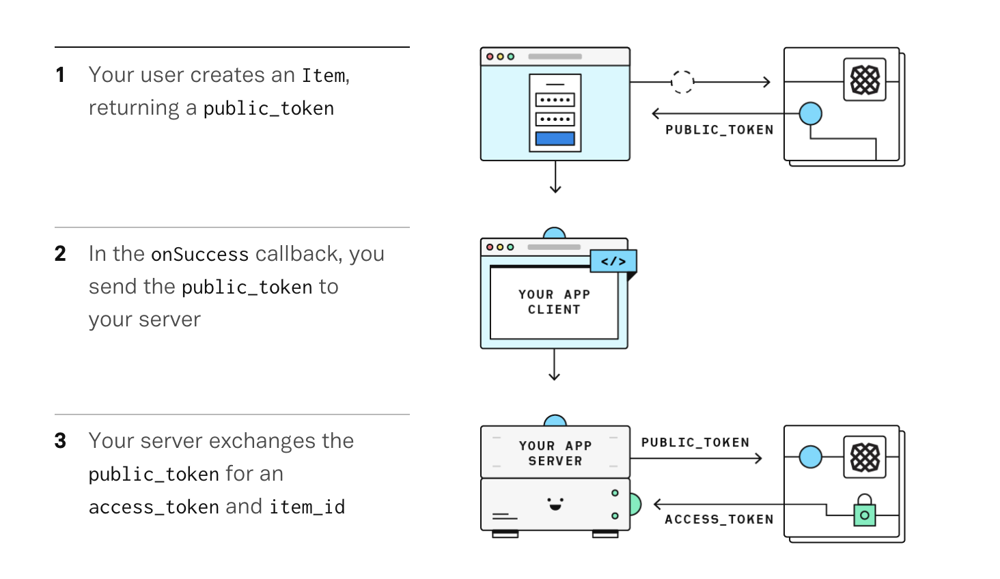

# Plaid Case Study

## Plaid Overview:

**Name of company:**

Plaid

**When was the company incorporated?**

The company was incorporated in 2013 by founders Zach Perret and William Hockey.

**What is Plaid?**

Plaid is a financial technology company based in San Francisco. The company builds a technology platform, which enables applications to connect with users' bank accounts. Plaid focuses on enabling consumers and businesses to interact with their bank accounts, check balances, and make payments through financial technology applications. 
Plaid is focused on democratizing financial services through technology. They build consumer experiences, developer-friendly infrastructure, and intelligent tools that give everyone the ability to create products that solve big problems.

In a nutshell, Plaid enables applications to sync with their users' bank accounts to track and manage their budgets, and transfer funds. Plaid's API essentially serves as the connecter between banks and fintechs, and it's currently being used by several popular brands like Venmo, Gusto, TransferWise, Charity Water, Venmo, Gusto, TransferWise, Charity Water, Robinhood, and Level Money.

**How did the idea for the company come about?**

Plaid was originally intended to be  a personal financial management and tracking tool for consumers, previously operating under the name "Silver" and then "Rambler". When confronted with difficulties in connecting bank accounts required for these tools, Plaid pivoted its core business focus to a unified banking API. 

**How is the company funded? How much funding have they received?**

Plaid has raised a total of $310 million. The company raised $60 million in Seed, Series A and Series B funding from Spark Capital, Google Ventures, New Enterprise Asssociates, Goldman Sachs, American Express, and Citibank. On December 11, 2018 they announced a $250 million Series C round with a valuation of $2.65 billion. The funding was led by Mary Meeker, with Andreessen Horowitz and Index Ventures also joining as new investors. Former backers also participated. 

## Sector Before Plaid Disruption:

With the fierce competition between financial institutions and the FinTech space, many institutions were reluctant to release customer information to FinTech innovation commpanies. 

Initially, companies such as Venmo and Paypal used Yodlee to gain access to customer bank accounts. Yodlee uses micro-transactions to varify customers bank accounts. Others uploaded PDFs of paper statements and typed in the data manually. Perret and Hockey sought to create an application programming interface, or API, to perform the same function with only a bank customer's online user name and password.

Today, Plaid has changed the way FinTech companies interact with financial institutions and share customer bank account information. 

SETTING UP SHOP in New York in the spring of 2012, with Perret as CEO and Hockey as CTO, the pair scored a stroke of luck. Venmo's engineering chief was in the process of cutting the cost of a peer-to-peer money transfer for making payments. The solution was settling transactions in big batches; while Venmo customers would transact instantly, the actual payment was delayed a day. Plaid helped remove the risk: Venmo would know in real time that the sender had a sufficient bank balance.

Venmo's validation helped the startup take off among other fintech customers that were looking to emulate Venmo's success. Some now-well-known apps would sign up months before they became household names.

## How Plaid Works:

Most API* requests interact with an Item*, a set of credentials (map of key value pairs) associated with a financial institution. A single end-user of your application might have accounts at different financial institutions, which means they would have multiple different Items.

Your users create Items through Link, a drop-in module that handles the credential and MFA* validation process. Once an Item is created, Link passes a public_token* that you exchange for an access_token* from your backend app server.

That access_token and item_id uniquely identify the Item. You use the access_token along with your client_id and secret to access products available for an Item and make changes to it over time.

Once you create an Item, you can then access data—such as transaction data and account and routing numbers—using our API endpoints. You access data for an Item using the Item’s access_token, which is specific to your API keys and cannot be shared or used by any other API keys. By default, an access_token never expires, but you can rotate it.

Once the API keys have been produced, the client must integrate with Plaid Link which handles credential validation, and MFA. 

Link allows your users to create Items and also update an Item if it goes into an error state, such as when they change their passwords or MFA information. 

An end-to-end integration involves client-side and server-side configurations. Below is a brief overview of how they interact. 

## Sector After Plaid Disruption:

Today Plaid's reach extends across tens of millions of end users and thousands of apps, which account for hundreds of billions in spending and financial planning. The comapnies revenue was $40 million last year, according to Forbes' estimate, and its cash-flow is close to break even. 

## Risks in the Market:

App makers who integrate with services like Amazon and Google expect their apps to work with a consistency impossible for a service like Plaid to even approach, says Warren Hogarth, who uses Plaid at his money manager startup, Empower. The problem, he says, is that Plaid remains at the mercy of the banks, which don't feel any urgency to share their customers' data with apps that aren't helping their bottom line. "It's a tricky place to be," he says.

Should the banks ever band together to offer their own joint APIs, they could undercut much of Plaid's business. Competition is also heating up, from new startups and from holdovers such as Yodlee and Finicity, which also offer solutions for connecting to banks by API. One venture capitalist who has studied fintech warns that with many bank accounts concentrated with a few leading banks, it could be hard for Plaid to maintain pricing if customers focus more on cost. "None of these companies using Plaid are cost optimizing yet," he says. "What happens when they're not focused on adding tons of new customers?"

Despite the popularity, this service appears to break two "fundamental" Internet security rules:

* Never give credentials to a third party. The standard is to redirect the user to a login page on the website of the service providing the login. Plaid doesn’t do this, instead providing the login form on their own website. Even worse, Plaid allows services to embed the form in their websites (as an iframe). It’s not possible for casual internet users to tell the difference between this and an “unsecured” form on some random website, so this appears to be encouraging bad security practice. Worse still, Plaid provides a login page that looks very official, showing the bank logo and using the bank’s color scheme.
* Never store passwords in plaintext. The only way for Plaid to access bank account details is with the password, and since my banking password was only required by Plaid once, they must be storing it in plaintext, or "encrypted" but convertible to plain text, so they can continue to use it to access my account.

## Products:

| Products: | Description: |
| -------- | ----------- |
| Authentication | Retrieve account and routing numbers for ACH* authentication. | 
| Transaction | Clear transaction data going back as far as 24 months. Transaction data may include contects such as geolocation, merchant, and category information. 
| Identity | Identity information on file with the bank. Reduce fraud by comparing user-submitted data to validate identity.
| Balance | Check balances in real time to prevent non-sufficient funds fee.
| Income | Varity employment and income information.
| Assets | Streamline borrower experiences by verifying assets, including account balanes, transaction histories and account holder identity information. 
|Investments | Access liabilities data for student loans and credit cards.
|Liabilities | Access liabilities data for student loans and credit cards.

Authentication:
The authentication endpoint then allows you to retrieve the bank account and routing numbers associated with an Item's checking and savings accounts, along with high-level account data and balances when available.

Transactions:
The transactions endpoint allows developers to receive user-authorized transaction data for credit, depository, and some loan-type Accounts. Transaction data is standardized across financial institutions, and in many cases transactions are linked to a clean name, entity type, location, and category.

Identity:
The identity endpoint allows you to retrieve various account holder information on file with the financial institution, including names, emails, phone numbers, and addresses.

Balance: 
The balance endpoint returns the real-time balance for each of an Item's accounts. It can be used for existing Items that were added via any of Plaid’s other products.

Income:
The income endpoint allows you to retrieve information pertaining to a Item’s income. In addition to the annual income, detailed information will be provided for each contributing income stream (or job). Details on each of these fields can be found below.

Assets:
The asset_report endpoints allow you to retrieve point-in-time snapshots of an Item or set of Items, including account balances, historical transactions, and account holder identity information, which we call Asset Reports.

Asset Reports are intended to be created on a per-user basis. In the context of a loan application, for example, the lender would create an Asset Report for each borrower on a given loan.

Finally, Asset Reports are immutable, meaning they can only be created and removed, not updated.

Investments:
The investments/holdings endpoints allow developers to retrieve user-authorized Holding, Security, and InvestmentTransactions data for a wide array of investment account and security types. Both Investments endpoints are only compatible with Items having Accounts of type investment.

Liabilities:
The liabilities endpoint returns various details about an Item with loan or credit accounts. The currently supported Account types are available here.

The types of information returned by Liabilities can include:

* Balances: how much is owed and over what pay period
* Payment timing: last payment date and next payment due date
* Current loan terms: interest rate, maturity, limits
* Account details: original loan amount, guarantor, and more

## Glossary:

*Application Programming Interface (API) is an interface or communication protocal between different parts of a computer program intended to simplify the implementation and maintenance of software. It can take the shape of a web-based system, operating system, database system, computer hardware, or library.

*Item: a set of credentials at a financial institution; each Item can have many accounts, and some accounts have transactions associated with them. 

*Multi-factor authentication (MFA) is an authentication method in which a computer user is granted access only after successfully presenting two or more pieces of evidence (or factors) to an authentication mechanism.

*Client ID: two private API keys; used to initialize Link and identify Items you create or update via Link.

*Public Token: a short-lived token that can be exchanged for an access_token or used to initialize Link in update mode for an Item. 

*Access Token: A rotatable token unique to a single Item; used to access data for that Item. In computer systems, an access token contains the security credentialsfor a login session and identifies the user, the users groups, the useres privileges, and in some cases, a particular application.

*Automated Clearing House (ACH): ACH or automated clearinghouse, is an electronic netowrk of financial transactions, generally domestic low value payments. ACHE is designed for high-volume, low-value payments, and charge fees low enough to encourage the transfer of low-value payments. 

## Works Cited:
1. "Quickstart." *Plaid*, plaid.com/docs/quickstart/.
2.  "Docs." *Plaid*, plaid.com/docs/.
3. "Institution-overview." *Plaid* plaid.com/docs/#institution-overview 
4. Pruitt, Jeff. "6 Fintechs Distrupting The Industry." *Inc.com*, Inc., 26 Jan. 2017, www.inc.com/jeff-pruitt/6-fintechs-distrupting-the-industry.html
5. "Plaid: Fintech's Happy Plumbers." *Forbes*, Forbes Magazine, www.forbes.com/plaid-fintech/#6145e4ad67f9.
